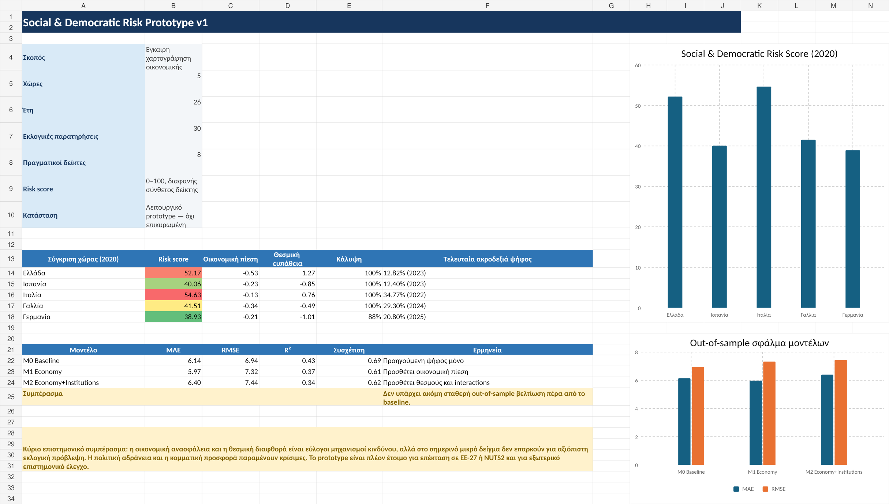

Social and Democratic Risk Prototype

Περιγραφή

Το παρόν έργο είναι ένα πιλοτικό ερευνητικό prototype που εξετάζει τη σχέση μεταξύ οικονομικής ανασφάλειας, θεσμικής ποιότητας και ακροδεξιάς εκλογικής συμπεριφοράς στην Ευρώπη κατά την περίοδο 2000–2025.

Η αρχική υπόθεση είναι ότι η οικονομική πίεση μπορεί να γίνει πολιτικά πιο επικίνδυνη όταν συνδυάζεται με διαφθορά, αδύναμο κράτος δικαίου, χαμηλή εμπιστοσύνη στους θεσμούς και ισχυρή ακροδεξιά πολιτική παρουσία.

Χώρες που εξετάζονται

- Ελλάδα
- Ισπανία
- Ιταλία
- Γαλλία
- Γερμανία

Βασικοί δείκτες

Το prototype περιλαμβάνει δείκτες όπως:

- ακροδεξιά ψήφος,
- ανεργία,
- πραγματικοί μισθοί,
- μερίδιο της εργασίας στο ΑΕΠ,
- ανάπτυξη και πληθωρισμός,
- αποβιομηχάνιση,
- πολιτική διαφθορά,
- κράτος δικαίου.

Μεθοδολογία

Δημιουργήθηκε ετήσιο dataset για την περίοδο 2000–2025 και ένας σύνθετος δείκτης κοινωνικού και δημοκρατικού κινδύνου από 0 έως 100.

Εξετάζονται τρία μοντέλα:

1. Μοντέλο που χρησιμοποιεί μόνο την προηγούμενη ακροδεξιά ψήφο.
2. Μοντέλο που προσθέτει οικονομικές μεταβλητές.
3. Μοντέλο που προσθέτει οικονομικές και θεσμικές μεταβλητές.

Η αξιολόγηση γίνεται με leave-one-country-out validation, αφήνοντας κάθε φορά μία χώρα εκτός της εκπαίδευσης του μοντέλου.

Πρώτα αποτελέσματα

Τα πρώτα αποτελέσματα δείχνουν ότι οι οικονομικές και θεσμικές μεταβλητές δεν βελτιώνουν ακόμη σταθερά την πρόβλεψη σε σχέση με το απλό μοντέλο της προηγούμενης εκλογικής επίδοσης.

Αυτό δεν αποδεικνύει ότι η θεωρία είναι λανθασμένη. Δείχνει ότι το σημερινό δείγμα είναι μικρό και ότι η ακροδεξιά ψήφος επηρεάζεται επίσης από την πολιτική οργάνωση, την κομματική ταυτότητα, την περιφερειακή ανισότητα και άλλους κοινωνικούς παράγοντες.

Αρχεία

Το βασικό Excel workbook περιλαμβάνει:

- διαδραστικό dashboard,
- ετήσιο dataset,
- risk score,
- scenario analysis,
- εκλογικά μοντέλα,
- validation,
- λεξικό μεταβλητών,
- μεθοδολογία και πηγές.

[Άνοιγμα του prototype](social_democratic_risk_prototype_v1.xlsx)

Περιορισμοί

Το έργο αποτελεί ερευνητικό prototype και όχι επικυρωμένο εργαλείο πολιτικής ή εκλογικής πρόβλεψης.

Ο δείκτης δεν υπολογίζει «την πιθανότητα εμφάνισης φασισμού» και δεν πρέπει να χρησιμοποιείται για βέβαιες προβλέψεις. Χρειάζεται επέκταση σε περισσότερες ευρωπαϊκές χώρες ή περιφέρειες, ανεξάρτητη αναπαραγωγή και επιστημονικός έλεγχος.

Επόμενα βήματα

- Επέκταση του δείγματος στην ΕΕ-27.
- Προσθήκη δεδομένων για στέγαση, ανισότητα και κοινωνική εμπιστοσύνη.
- Περιφερειακή ανάλυση σε επίπεδο NUTS2.
- Έλεγχος από οικονομολόγους, πολιτικούς επιστήμονες και στατιστικούς.
- Βελτίωση της εκτός δείγματος αξιολόγησης.
